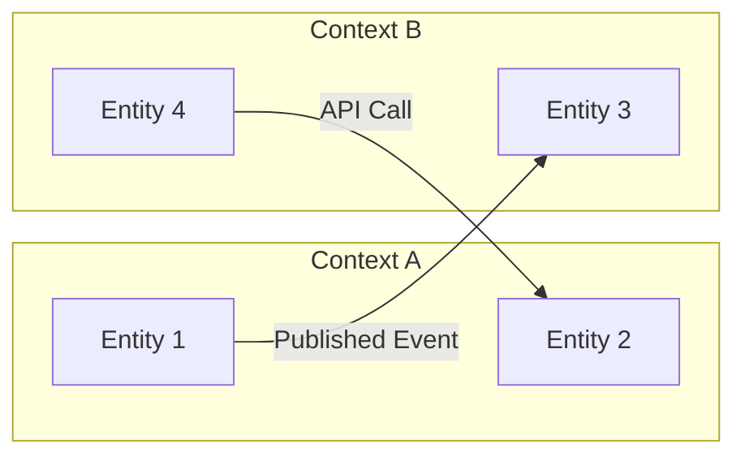
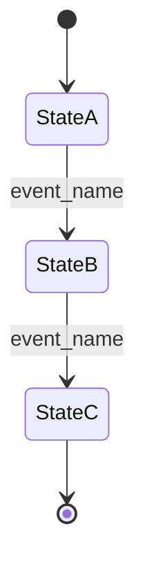

# Skill: Data Model Design (Domain-Driven Design)

Model the domain at the conceptual level before it becomes tables and columns. This skill produces the authoritative domain model that drives both the database schema (via `database_design.md`) and the API contracts (via `api_contract_design.md`). Get the domain model right, and everything downstream aligns naturally.

---

## Prerequisites

Before invoking this skill, ensure the following exist:

- `PRD.md` or `SCOPE_DEFINITION.md` — for domain language and requirements
- `USER_JOURNEYS.md` or `PERSONAS.md` — for understanding how users interact with domain concepts
- Prior research output — domain-specific knowledge gathered in earlier workflow stages

---

## Step 1: Identify the Ubiquitous Language

Extract every domain-specific term from the PRD, user stories, and research. This becomes the shared vocabulary across code, API, UI, and documentation.

| Term | Definition | Used By (Roles) | Example |
|------|-----------|-----------------|---------|
| | | | |

Rules:
- Use the language of the business, not engineering abstractions
- If the same concept has different names in different contexts, note both and pick one canonical name
- If a term is ambiguous, resolve it now — ambiguity in the domain model becomes bugs in the code

---

## Step 2: Identify Bounded Contexts

A bounded context is a boundary within which a particular domain model applies. Different contexts may use the same words to mean different things.

For each bounded context:

```markdown
### Bounded Context: [Name]

**Responsibility:** [What this context owns]
**Key entities:** [List]
**Team owner:** [If applicable — which team/service owns this context]

**Upstream dependencies:** [Contexts this one consumes data from]
**Downstream dependents:** [Contexts that consume data from this one]

**Integration pattern:** [How this context communicates with others]
- Shared Kernel / Customer-Supplier / Conformist / Anti-Corruption Layer / Published Language / Open Host Service
```

Produce a context map showing relationships:



---

## Step 3: Define Aggregates

An aggregate is a cluster of domain objects treated as a single unit for data changes. Each aggregate has a root entity and enforces invariants within its boundary.

For **each** aggregate:

```markdown
### Aggregate: [Name]

**Root entity:** [The entity through which all access flows]
**Contained entities:** [Entities that exist only within this aggregate]
**Contained value objects:** [Value objects within this aggregate]

**Invariants (business rules that must always be true):**
1. [Invariant description] — enforced by: [method/check]
2. [Invariant description] — enforced by: [method/check]

**Consistency boundary:**
- **Internal consistency:** [Strong — all changes within the aggregate are immediately consistent]
- **External consistency:** [Eventual — changes across aggregate boundaries are eventually consistent via domain events]

**Lifecycle:**
- **Creation:** [What triggers creation, required fields, validation rules]
- **Modification:** [Allowed state transitions, who can modify]
- **Deletion:** [Soft/hard delete, cascading effects, archival rules]

**Concurrency strategy:**
- [Optimistic locking (version field) / Pessimistic locking / Last-write-wins — with rationale]
```

Aggregate design rules:
- Keep aggregates small — prefer more small aggregates over fewer large ones
- Reference other aggregates by ID only, never by direct object reference
- Only the aggregate root should be accessible from outside the aggregate
- A single transaction should modify only one aggregate (cross-aggregate changes go through domain events)

---

## Step 4: Define Entities

Entities have identity that persists through state changes. Two entities with identical attributes but different IDs are different entities.

For **each** entity:

```markdown
### Entity: [Name]

**Belongs to aggregate:** [Aggregate name]
**Identity:** [What makes this entity unique — usually an ID]

**Attributes:**
| Attribute | Type | Required | Mutable | Validation Rules | Description |
|-----------|------|----------|---------|-----------------|-------------|
| id | UUID | Yes | No | Auto-generated | Unique identifier |
| | | | | | |

**State transitions (if stateful):**


**Behavior (methods/operations):**
| Method | Input | Output | Side Effects | Validation |
|--------|-------|--------|-------------|------------|
| | | | | |
```

---

## Step 5: Define Value Objects

Value objects have no identity — they are defined entirely by their attributes. Two value objects with identical attributes are interchangeable.

For **each** value object:

```markdown
### Value Object: [Name]

**Used by:** [Which entities/aggregates contain this]

**Attributes:**
| Attribute | Type | Validation Rules |
|-----------|------|-----------------|
| | | |

**Equality:** Two [Name] objects are equal when [all attributes match]
**Immutability:** Value objects are always immutable. To change, create a new instance.

**Factory/creation rules:**
- [How this value object is constructed]
- [Validation that runs at creation time]

**Examples:**
- Valid: [example]
- Invalid: [example and why]
```

Common value objects to consider:
- Money (amount + currency)
- EmailAddress (validated format)
- DateRange (start + end with start <= end invariant)
- Address (street, city, state, zip, country)
- Coordinates (latitude, longitude)
- PhoneNumber (validated format + country code)

---

## Step 6: Define Domain Events

Domain events represent something meaningful that happened in the domain. They are the primary mechanism for cross-aggregate communication.

For **each** domain event:

```markdown
### Event: [PastTenseVerbNoun] (e.g., OrderPlaced, UserRegistered, PaymentFailed)

**Emitted by:** [Aggregate name]
**Trigger:** [What causes this event to be emitted]
**Consumers:** [Which bounded contexts/aggregates react to this]

**Payload:**
| Field | Type | Description |
|-------|------|-------------|
| event_id | UUID | Unique event identifier |
| occurred_at | ISO 8601 timestamp | When the event happened |
| aggregate_id | UUID | ID of the aggregate that emitted the event |
| | | |

**Ordering guarantee:** [Ordered per aggregate / Global ordering / No ordering guarantee]
**Delivery guarantee:** [At-least-once / At-most-once / Exactly-once]
**Idempotency:** [How consumers handle duplicate delivery]
```

Event naming conventions:
- Use past tense: `OrderPlaced`, not `PlaceOrder` or `OrderPlace`
- Be specific: `PaymentDeclined` is better than `PaymentFailed` if the reason matters
- Include enough data for consumers to act without querying back

---

## Step 7: Serialization Formats

Define how domain objects are serialized for persistence, API responses, and event payloads:

### Persistence Serialization

| Domain Concept | Storage Format | Notes |
|---------------|---------------|-------|
| Entities | Relational rows (one entity = one row) | Field-level mapping |
| Value Objects (simple) | Columns on parent entity table | Flattened into parent |
| Value Objects (complex) | JSONB column or separate table | Depends on query needs |
| Enums/Status | String column or enum type | Use string for portability |
| Collections | Separate table with foreign key | Never serialize arrays into a single column |

### API Serialization

| Domain Concept | JSON Representation | Notes |
|---------------|-------------------|-------|
| Entity | Object with `id` field | Include only fields the consumer needs |
| Value Object | Nested object or flat fields | Depends on complexity |
| Enum | String literal | Use lowercase_snake_case or UPPER_CASE consistently |
| Timestamps | ISO 8601 string | Always include timezone (UTC preferred) |
| Money | `{ "amount": 1999, "currency": "USD" }` | Store as minor units (cents) |

### Event Serialization

- Format: JSON (or Protobuf if using gRPC ecosystem)
- Schema registry: [Yes/No — if yes, which tool]
- Schema evolution rules: [Backward compatible — new optional fields only / Versioned schemas]

---

## Step 8: Validation Rules

Define validation rules at each layer:

### Domain-Level Validation (always enforced)

| Rule | Applies To | Error When Violated |
|------|-----------|-------------------|
| | | |

### Application-Level Validation (enforced at service/use case layer)

| Rule | Applies To | Error When Violated |
|------|-----------|-------------------|
| | | |

### Input Validation (enforced at API boundary)

| Field | Type Check | Format Check | Range Check | Custom Rule |
|-------|-----------|-------------|-------------|-------------|
| | | | | |

Validation hierarchy:
1. **Input validation** catches malformed requests at the API boundary (fast, cheap)
2. **Application validation** enforces business rules at the use case level
3. **Domain validation** enforces invariants within aggregates (always true, never bypassed)
4. **Database constraints** are the last line of defense (foreign keys, check constraints, unique constraints)

Never rely on only one layer. Defense in depth.

---

## Step 9: Cross-Reference Validation

Before finalizing, verify:

- [ ] Every domain term from the PRD appears in the ubiquitous language glossary
- [ ] Every aggregate has at least one invariant defined
- [ ] Aggregate boundaries are small — no aggregate contains more than 5-7 entities
- [ ] Cross-aggregate references use IDs only, never object references
- [ ] Every state transition is explicitly defined with trigger events
- [ ] Domain events carry enough data for consumers to act independently
- [ ] Serialization formats are consistent across persistence, API, and events
- [ ] Validation rules exist at every layer (input, application, domain, database)

---

## Output

The final output feeds into the Data Architecture and Backend Architecture sections of `ARCHITECTURE.md`. The domain model serves as the shared reference for `database_design.md` (physical schema) and `api_contract_design.md` (API shapes).
