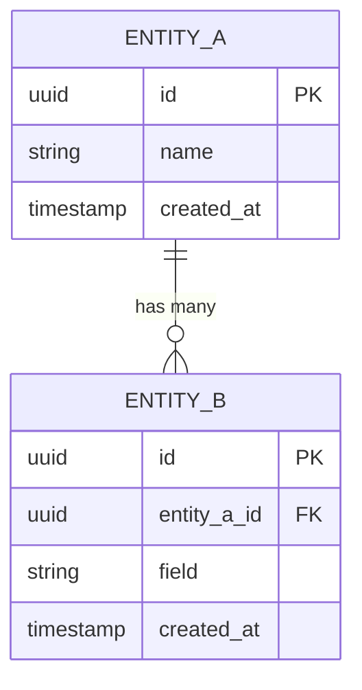

# Skill: Database Design

Design the data persistence layer. Every table must be justified by a domain entity or system requirement. Schema design is permanent — mistakes here propagate through every layer above. Get it right.

---

## Prerequisites

Before invoking this skill, ensure the following exist:

- `TECH_STACK.md` — for database engine, ORM/data access layer, migration tool
- `PRD.md` or `SCOPE_DEFINITION.md` — for domain entities and relationships
- `data_model_design.md` output (if already produced) — for aggregates and bounded contexts

---

## Step 1: Research Schema Patterns

**Browser: 3-5 searches**

1. Search for "[database engine from TECH_STACK.md] schema design for [product domain]"
2. Search for "[database engine] best practices [current year]"
3. Search for "[ORM from TECH_STACK.md] migration best practices"
4. If using PostgreSQL: search for "PostgreSQL advanced data types for [domain]" (JSONB, arrays, enums, ranges)
5. If NoSQL: search for "[database] data modeling patterns" and "[database] embedding vs referencing"
6. Look for open-source projects in the same domain to study their schema patterns

Record findings for reference in subsequent steps.

---

## Step 2: Entity Identification

From the PRD and domain model, list every persistent entity:

| Entity | Description | Estimated Row Count (Year 1) | Growth Rate | Access Pattern |
|--------|-------------|------------------------------|-------------|----------------|
| | | | | Read-heavy / Write-heavy / Balanced |

Classify entities:
- **Core entities:** central to the product (e.g., User, Project, Order)
- **Supporting entities:** enable core entities (e.g., AuditLog, Notification, Setting)
- **Junction entities:** many-to-many relationships (e.g., ProjectMember, RolePermission)
- **Lookup/reference entities:** relatively static data (e.g., Country, Category, Status)

---

## Step 3: Entity-Relationship Diagram

Produce a Mermaid ERD covering all entities and their relationships:



Relationship notation:
- `||--||` — one to one
- `||--o{` — one to many
- `o{--o{` — many to many (via junction table)
- `||--o|` — one to zero-or-one

---

## Step 4: Table Definitions

For **each** table, define the complete schema:

```markdown
### [table_name]

**Purpose:** [What domain entity this represents]
**Access pattern:** [Read-heavy / Write-heavy / Balanced]
**Estimated size:** [Row count year 1 / year 3]

| Column | Type | Nullable | Default | Constraints | Description |
|--------|------|----------|---------|-------------|-------------|
| id | UUID | NO | gen_random_uuid() | PK | Primary identifier |
| ... | ... | ... | ... | ... | ... |
| created_at | TIMESTAMP WITH TIME ZONE | NO | NOW() | | Row creation time |
| updated_at | TIMESTAMP WITH TIME ZONE | NO | NOW() | | Last update time |

**Check constraints:**
- `chk_[name]`: [expression] — [rationale]

**Unique constraints:**
- `uniq_[name]`: ([columns]) — [rationale]

**Foreign keys:**
- `fk_[name]`: [column] REFERENCES [table]([column]) ON DELETE [CASCADE/SET NULL/RESTRICT] — [rationale for delete behavior]
```

Rules for every table:
- Every table gets a primary key (prefer UUID over serial for distributed-friendly IDs)
- Every table gets `created_at` and `updated_at` timestamps
- Use `TIMESTAMP WITH TIME ZONE` (never `TIMESTAMP WITHOUT TIME ZONE`)
- Use appropriate column types (e.g., `citext` for case-insensitive text, `inet` for IPs, `jsonb` for flexible structured data)
- Define `NOT NULL` on every column unless there is an explicit reason for nullability
- Define `ON DELETE` behavior for every foreign key
- Add check constraints for domain invariants (e.g., `price >= 0`, `status IN ('active', 'inactive')`)

---

## Step 5: Index Strategy

Define indexes based on query patterns:

| Table | Index Name | Columns | Type | Rationale |
|-------|-----------|---------|------|-----------|
| | `idx_[table]_[columns]` | | B-tree / GIN / GiST / Hash / BRIN | |

Indexing guidelines:
- **Always index:** foreign key columns, columns in WHERE clauses, columns in ORDER BY
- **Consider composite indexes:** for queries that filter on multiple columns (leftmost prefix rule)
- **Partial indexes:** for queries that filter on a status (e.g., `WHERE deleted_at IS NULL`)
- **GIN indexes:** for JSONB fields, array columns, full-text search
- **BRIN indexes:** for time-series data with natural ordering
- **Unique indexes:** enforce uniqueness constraints (these double as constraints)

Avoid:
- Indexes on low-cardinality boolean columns (unless partial)
- Too many indexes on write-heavy tables (each index slows writes)

---

## Step 6: Migration Versioning Scheme

Define the migration strategy aligned with TECH_STACK.md:

### Versioning Format

Choose one:
- **Sequential numbering:** `001_create_users.sql`, `002_create_projects.sql` — simpler, risk of conflicts in team environments
- **Timestamped:** `20240101120000_create_users.sql` — avoids conflicts, harder to read sequence
- **Framework-managed:** let the ORM handle numbering (e.g., Prisma, Django, Rails)

### Migration Rules

1. **Every migration must be reversible.** Define both `up` and `down` operations.
2. **One logical change per migration.** Do not combine unrelated schema changes.
3. **Never modify a migration that has been applied to staging/production.** Create a new migration instead.
4. **Seed data goes in separate seed files,** not in migrations.
5. **Use transactions** for migrations where the database supports transactional DDL.
6. **Test migrations against a copy of production data** before applying to production.

### Migration Template

```sql
-- Migration: [NUMBER]_[description].sql
-- Description: [what this migration does]
-- Reversible: Yes

-- UP
BEGIN;

CREATE TABLE [table_name] (
    -- columns
);

CREATE INDEX [index_name] ON [table_name] ([columns]);

COMMIT;

-- DOWN
BEGIN;

DROP INDEX IF EXISTS [index_name];
DROP TABLE IF EXISTS [table_name];

COMMIT;
```

---

## Step 7: Data Integrity Constraints

Beyond basic foreign keys and check constraints, define:

### Application-Level Constraints

| Constraint | Enforcement Layer | Description |
|-----------|------------------|-------------|
| | DB / Application / Both | |

### Soft Deletes vs. Hard Deletes

For each entity, define the deletion strategy:

| Entity | Strategy | Implementation | Rationale |
|--------|----------|---------------|-----------|
| | Soft delete (`deleted_at` column) / Hard delete / Archive to separate table | | |

If using soft deletes:
- Add `deleted_at TIMESTAMP WITH TIME ZONE NULL` column
- Add partial index: `WHERE deleted_at IS NULL` on frequently queried columns
- Ensure all queries default-filter on `deleted_at IS NULL`
- Define a data retention policy (when are soft-deleted records permanently purged)

### Audit Trail

If the domain requires auditability:
- Define an `audit_log` table with: entity_type, entity_id, action, actor_id, old_values (JSONB), new_values (JSONB), timestamp
- Or use database triggers / CDC (Change Data Capture) — specify which approach and why

---

## Step 8: Partitioning Strategy

Evaluate whether any table needs partitioning:

**Partitioning is warranted when:**
- Table is projected to exceed 100M+ rows
- Queries consistently filter on a partitionable column (date, tenant_id)
- Maintenance operations (VACUUM, reindex) become expensive on the full table

| Table | Partition Strategy | Partition Key | Partition Interval | Retention Policy |
|-------|-------------------|---------------|-------------------|-----------------|
| | Range / List / Hash | | | |

If partitioning is not needed for MVP, state this explicitly with the threshold at which it should be revisited.

---

## Step 9: Cross-Reference Validation

Before finalizing, verify:

- [ ] Every domain entity from the PRD has a corresponding table
- [ ] Every table has a clear owner (which service/module manages it)
- [ ] All relationships are defined with appropriate foreign key constraints
- [ ] ON DELETE behavior is explicitly defined for every foreign key
- [ ] Index strategy covers all known query patterns
- [ ] Migration versioning scheme is documented and consistent
- [ ] Soft delete vs. hard delete is decided for every entity
- [ ] Estimated data volumes are documented for capacity planning
- [ ] No circular foreign key dependencies exist (or they are explicitly noted with resolution strategy)

---

## Output

The final output is written to the Data Architecture section of `ARCHITECTURE.md` or as referenced by the invoking workflow. Include the Mermaid ERD, all table definitions, index strategy, and migration scheme.
