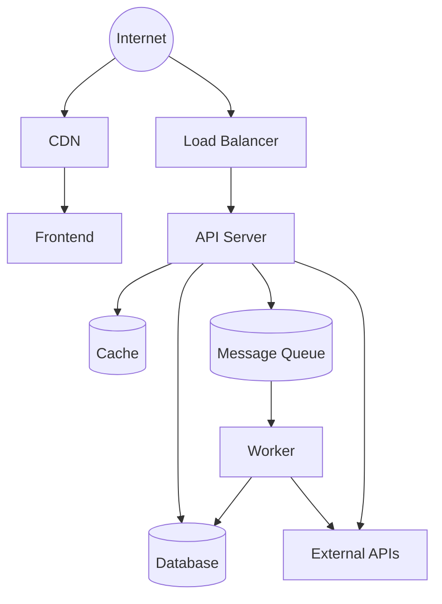

# Skill: Deployment Topology

Define where and how the system runs. The deployment topology determines reliability, scalability, cost, and deployment velocity. Every service, database, cache, and external dependency must have a defined place in the topology with clear operational contracts.

---

## Prerequisites

Before invoking this skill, ensure the following exist:

- `TECH_STACK.md` — for hosting, containerization, orchestration, CI/CD choices
- `ARCHITECTURE.md` (partial) — for system components and their interactions
- `PRD.md` — for scale targets and availability requirements

---

## Step 1: Research Deployment Patterns

**Browser: 3-5 searches**

1. Search for "[hosting provider from TECH_STACK.md] deployment best practices [current year]"
2. Search for "[orchestration from TECH_STACK.md] production deployment patterns" (e.g., "Kubernetes deployment strategies", "Docker Compose production setup", "ECS deployment patterns")
3. Search for "blue-green vs canary deployment tradeoffs"
4. Search for "[hosting provider] auto-scaling configuration"
5. If serverless: search for "[serverless platform] cold start optimization"

Record findings for reference in subsequent steps.

---

## Step 2: Service Map

Enumerate every deployed service and its dependencies:

### Service Inventory

| Service | Type | Technology | Port | Dependencies | Stateful |
|---------|------|-----------|------|-------------|----------|
| API Server | Web application | [from TECH_STACK.md] | 8080 | Database, Cache, Queue | No |
| Frontend | Static assets / SSR | [from TECH_STACK.md] | 3000 | API Server | No |
| Worker | Background processor | [from TECH_STACK.md] | N/A | Database, Queue | No |
| Database | Data store | [from TECH_STACK.md] | 5432 | None | Yes |
| Cache | Cache layer | [from TECH_STACK.md] | 6379 | None | Ephemeral |
| Queue | Message broker | [from TECH_STACK.md] | 5672 | None | Durable |
| CDN | Content delivery | [from TECH_STACK.md] | 443 | Frontend origin | No |
| Load Balancer | Traffic routing | [from TECH_STACK.md] | 443 | API Server | No |

### Service Dependency Diagram



### Communication Protocols

| From | To | Protocol | Auth | Encryption |
|------|-----|----------|------|-----------|
| Client | CDN | HTTPS | None (public) | TLS 1.2+ |
| Client | LB | HTTPS | Bearer token | TLS 1.2+ |
| LB | API | HTTP/HTTPS | Internal | TLS or VPC internal |
| API | Database | TCP | Connection string | TLS |
| API | Cache | TCP | Password/ACL | TLS or VPC internal |
| API | Queue | AMQP/TCP | Credentials | TLS or VPC internal |
| Worker | Database | TCP | Connection string | TLS |
| API | External APIs | HTTPS | API key/OAuth | TLS 1.2+ |

---

## Step 3: Environment Definitions

### Environment Matrix

| Property | Development | Staging | Production |
|----------|------------|---------|-----------|
| **Purpose** | Local development | Pre-prod validation | Live traffic |
| **URL** | `localhost:3000` | `staging.[domain]` | `[domain]` |
| **API URL** | `localhost:8080` | `api.staging.[domain]` | `api.[domain]` |
| **Database** | Local / Docker | Managed (small instance) | Managed (production-size) |
| **Cache** | Local / Docker | Managed (small) | Managed (clustered) |
| **Data** | Seed data / fixtures | Sanitized prod snapshot | Real data |
| **Secrets management** | `.env` file (gitignored) | Cloud secret manager | Cloud secret manager |
| **Logging level** | DEBUG | INFO | WARN |
| **Error tracking** | Console only | Sentry (separate project) | Sentry (production) |
| **Monitoring** | None | Basic | Full observability stack |
| **SSL** | Self-signed / none | Managed certificate | Managed certificate |
| **Deployment** | Manual / hot reload | CI/CD on merge to staging | CI/CD on merge to main |
| **Access** | Developer machine | Team + QA | Public |

### Environment Variables

Define the environment variables each service requires:

| Variable | Description | Dev Value | Staging/Prod Value | Secret |
|----------|-----------|-----------|-------------------|--------|
| `DATABASE_URL` | Database connection string | `postgres://localhost/app_dev` | From secret manager | Yes |
| `REDIS_URL` | Cache connection string | `redis://localhost:6379` | From secret manager | Yes |
| `API_BASE_URL` | Public API URL | `http://localhost:8080` | `https://api.[domain]` | No |
| `JWT_SECRET` | Token signing key | Generated locally | From secret manager | Yes |
| `LOG_LEVEL` | Logging verbosity | `debug` | `info` / `warn` | No |
| `NODE_ENV` / `APP_ENV` | Environment identifier | `development` | `staging` / `production` | No |
| `CORS_ORIGINS` | Allowed CORS origins | `http://localhost:3000` | `https://[domain]` | No |
| `SENTRY_DSN` | Error tracking endpoint | Empty | From secret manager | Yes |

---

## Step 4: Container Configuration

### Container Images

For each containerized service:

```markdown
### Service: [Name]

**Base image:** [e.g., node:20-alpine, golang:1.22-alpine, python:3.12-slim]
**Multi-stage build:** Yes — build stage + runtime stage
**Final image size target:** < [X] MB

**Build stage:**
- Install dependencies
- Run build/compile
- Run tests (optional — can be separate CI step)

**Runtime stage:**
- Copy built artifacts only
- Run as non-root user
- Set resource limits
- Define health check

**Exposed ports:** [port]
**Entry point:** [command]
```

### Docker Compose (Development)

Define the local development stack:

```yaml
# docker-compose.yml structure (not the full file — adapt to TECH_STACK.md)
services:
  api:
    build: ./api
    ports: ["8080:8080"]
    environment: [from env vars above]
    depends_on: [db, cache, queue]
    volumes: [source code for hot reload]

  frontend:
    build: ./frontend
    ports: ["3000:3000"]
    volumes: [source code for hot reload]

  db:
    image: [database image]
    ports: ["5432:5432"]
    volumes: [persistent data volume]

  cache:
    image: [cache image]
    ports: ["6379:6379"]

  queue:
    image: [queue image]
    ports: ["5672:5672"]
```

---

## Step 5: Scaling Rules

### Horizontal Scaling

| Service | Min Instances | Max Instances | Scale Up Trigger | Scale Down Trigger | Cooldown |
|---------|-------------|-------------|-----------------|-------------------|---------|
| API Server | 2 | [max] | CPU > 70% for 2 min OR RPS > [threshold] | CPU < 30% for 5 min | 3 min |
| Worker | 1 | [max] | Queue depth > [threshold] for 1 min | Queue depth < [threshold] for 5 min | 3 min |
| Frontend (if SSR) | 2 | [max] | CPU > 70% for 2 min | CPU < 30% for 5 min | 3 min |

### Vertical Scaling (Resource Limits)

| Service | CPU Request | CPU Limit | Memory Request | Memory Limit |
|---------|-----------|----------|---------------|-------------|
| API Server | [value] | [value] | [value] | [value] |
| Worker | [value] | [value] | [value] | [value] |
| Frontend | [value] | [value] | [value] | [value] |

### Database Scaling

| Metric | Threshold | Action |
|--------|----------|--------|
| Connection count | > 80% of max | Add read replicas or increase max connections |
| CPU utilization | > 70% sustained | Scale up instance size |
| Storage usage | > 80% | Increase storage, review data retention |
| Replication lag | > 1s | Investigate, reduce write load or upgrade replica |

### Scaling Limitations

| Constraint | Limit | Mitigation |
|-----------|-------|------------|
| Database connections | [max per instance] x [instances] | Connection pooling (PgBouncer, ProxySQL) |
| External API rate limits | [per third-party API] | Queue and throttle outbound requests |
| Session affinity | Required if using in-memory sessions | Use external session store (Redis) |

---

## Step 6: Health Check Contracts

### Health Check Endpoints

For each service, define health check endpoints:

```markdown
### Service: [Name]

**Liveness probe:** `/health/live`
- **Purpose:** Is the process running and not deadlocked?
- **Checks:** Process is responsive
- **Expected response:** `200 OK` with `{"status": "ok"}`
- **Failure action:** Restart the container/process
- **Interval:** 10s | Timeout: 3s | Failure threshold: 3

**Readiness probe:** `/health/ready`
- **Purpose:** Is the service ready to accept traffic?
- **Checks:** Database connected, cache connected, migrations applied
- **Expected response:** `200 OK` with dependency status:
  ```json
  {
    "status": "ok",
    "checks": {
      "database": { "status": "ok", "latency_ms": 2 },
      "cache": { "status": "ok", "latency_ms": 1 },
      "queue": { "status": "ok", "latency_ms": 1 }
    }
  }
  ```
- **Failure response:** `503 Service Unavailable` with failing dependency
- **Failure action:** Remove from load balancer (do not restart)
- **Interval:** 5s | Timeout: 5s | Failure threshold: 2

**Startup probe (if slow startup):**
- **Purpose:** Has the service finished initializing?
- **Interval:** 5s | Timeout: 10s | Failure threshold: 30 (allows 2.5 min startup)
```

### Dependency Health Checks

| Dependency | Check Method | Timeout | Failure Behavior |
|-----------|-------------|---------|-----------------|
| Database | `SELECT 1` or connection ping | 3s | Mark readiness as failed |
| Cache | `PING` command | 1s | Mark readiness as failed (or degrade gracefully) |
| Queue | Connection check | 3s | Mark readiness as failed for workers |
| External API | HEAD request to health endpoint | 5s | Circuit breaker (degrade feature) |

---

## Step 7: Deployment Strategy

### Approach Selection

| Strategy | When to Use | Tradeoffs |
|----------|-------------|-----------|
| **Rolling update** | Stateless services, quick rollback not critical | Simple, brief mixed-version period |
| **Blue-green** | Zero-downtime required, instant rollback needed | Requires 2x resources during deploy |
| **Canary** | Gradual rollout, testing in production | Complex routing, slower rollout |
| **Recreate** | Stateful services that cannot run mixed versions | Brief downtime during switch |

Selected strategy: **[Choose based on requirements]**

### Deployment Pipeline

```
Code Push → CI (Build + Test) → Build Container Image → Push to Registry
    → Deploy to Staging → Run Integration Tests → Manual Approval
    → Deploy to Production → Smoke Tests → Monitor → Rollback if needed
```

### Deployment Steps (Production)

```markdown
1. **Pre-deployment checks:**
   - All CI tests pass
   - Staging deployment verified
   - Database migrations are backward-compatible (if any)
   - Feature flags configured for new features

2. **Database migrations (if any):**
   - Run migrations before deploying new code (forward-compatible)
   - Verify migration success
   - Migrations must be backward-compatible with current code version

3. **Deploy new version:**
   - [Blue-green]: Route traffic to new environment after health checks pass
   - [Rolling]: Replace instances one at a time, wait for health check between each
   - [Canary]: Route 5% → 25% → 50% → 100% with monitoring at each step

4. **Post-deployment verification:**
   - Smoke tests pass (critical user flows)
   - Error rate has not increased
   - Latency is within SLA
   - No increase in 5xx responses

5. **Rollback trigger (automatic):**
   - Error rate > 5% for 2 minutes
   - p99 latency > 5x baseline for 2 minutes
   - Health checks failing on > 50% of instances
```

---

## Step 8: Rollback Strategy

### Rollback Procedures

| Scenario | Rollback Method | Time to Recover | Data Impact |
|----------|----------------|-----------------|-------------|
| Bad code deploy (no migration) | Redeploy previous version | < 2 minutes | None |
| Bad code + backward-compatible migration | Redeploy previous version (migration stays) | < 2 minutes | None |
| Bad migration (data loss risk) | Restore from backup + redeploy | 15-60 minutes | Potential data loss since backup |
| Infrastructure failure | Failover to standby / recreate from IaC | 5-15 minutes | Depends on replication lag |
| Dependency outage | Circuit breaker + degraded mode | Automatic | Feature degradation |

### Rollback Decision Matrix

| Metric | Warning | Auto-Rollback | Manual Decision |
|--------|---------|-------------|-----------------|
| Error rate (5xx) | > 1% | > 5% for 2 min | Between 1-5% |
| Latency (p99) | > 2x baseline | > 5x baseline for 2 min | Between 2-5x |
| Health check failures | > 25% of instances | > 50% of instances | Between 25-50% |
| Business metric anomaly | > 10% deviation | N/A | Any deviation |

### Rollback Runbook

```markdown
## Emergency Rollback Procedure

1. **Confirm the issue:**
   - Check error rate dashboard
   - Check latency dashboard
   - Verify the issue started after the deploy

2. **Initiate rollback:**
   - [Blue-green]: Switch traffic back to previous environment
   - [Rolling]: Deploy previous container image tag
   - [Canary]: Route 100% to stable version, terminate canary

3. **Verify rollback:**
   - Error rate returns to baseline
   - Latency returns to baseline
   - Health checks all passing

4. **Post-rollback:**
   - Notify the team
   - Create incident report
   - Investigate root cause before re-attempting deploy
```

---

## Step 9: Infrastructure as Code

### IaC Approach

| Property | Value |
|----------|-------|
| Tool | [Terraform / Pulumi / CloudFormation / CDK — from TECH_STACK.md or team preference] |
| State storage | [Remote backend — S3 + DynamoDB, GCS, Terraform Cloud] |
| Module structure | [Per-service or per-environment] |
| Secret management | [Cloud KMS, Vault, SOPS — never in IaC state files] |

### Directory Structure

```
infrastructure/
  modules/
    networking/       # VPC, subnets, security groups
    database/         # RDS/Cloud SQL configuration
    cache/            # Redis/Memcached configuration
    compute/          # ECS/K8s/VM configuration
    cdn/              # CDN configuration
    monitoring/       # Dashboards, alerts
  environments/
    dev/              # Dev-specific overrides
    staging/          # Staging-specific overrides
    production/       # Production-specific overrides
```

### Drift Detection

- Run `terraform plan` / equivalent on a schedule (daily)
- Alert on any detected drift
- All infrastructure changes go through PR review and CI/CD

---

## Step 10: Cross-Reference Validation

Before finalizing, verify:

- [ ] Every service in the architecture has a defined deployment configuration
- [ ] All environments (dev, staging, prod) are defined with appropriate configurations
- [ ] Health checks are defined for every service
- [ ] Scaling rules cover expected traffic patterns from PRD
- [ ] Rollback procedure is documented and tested
- [ ] Secrets are never hardcoded (all from secret manager or environment variables)
- [ ] Container images use specific version tags (not `latest`)
- [ ] Infrastructure as code covers all provisioned resources
- [ ] Deployment strategy aligns with availability SLA from `performance_budget.md`

---

## Output

The final output feeds into the Deployment Architecture section of `ARCHITECTURE.md`. The deployment topology serves as the reference for CI/CD pipeline configuration, infrastructure provisioning, and operational runbooks.
