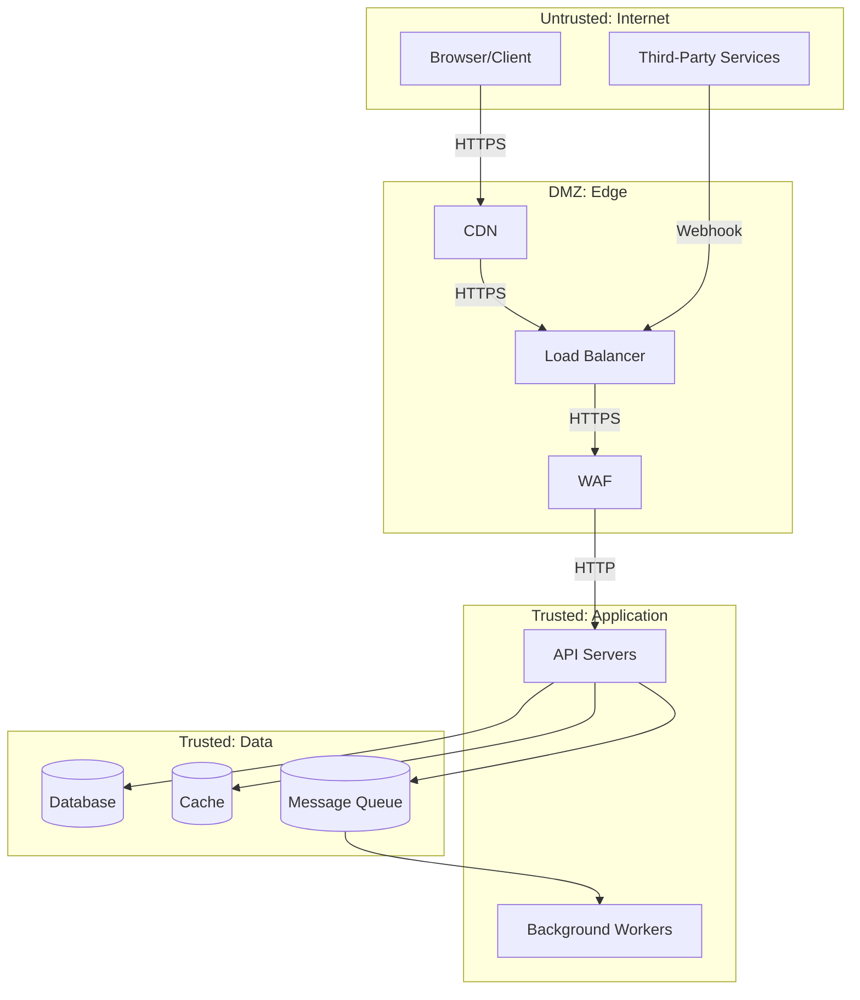
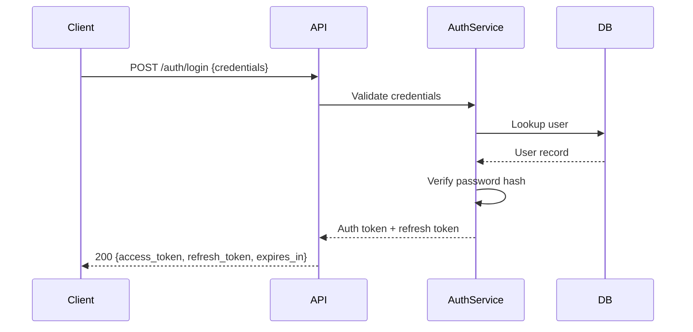

# Skill: Security Threat Model

Systematically identify security threats using the STRIDE framework. Every component in the architecture must be evaluated. Security is not a feature — it is a constraint that applies to every feature.

---

## Prerequisites

Before invoking this skill, ensure the following exist:

- `TECH_STACK.md` — for auth model, infrastructure choices, and framework
- `ARCHITECTURE.md` (partial or complete) — for system topology and data flows
- `PRD.md` — for understanding what data the system handles and who the users are

---

## Step 1: Research Domain-Specific Threats

**Browser: 3-5 searches**

1. Search for "OWASP top 10 [current year]" — review the current list
2. Search for "[product domain] security threats" (e.g., "e-commerce security threats", "healthcare application security")
3. Search for "[auth model from TECH_STACK.md] security best practices" (e.g., "JWT security best practices")
4. Search for "[framework from TECH_STACK.md] security hardening"
5. If handling PII: search for "[applicable regulation] technical requirements" (e.g., "GDPR technical requirements", "HIPAA security rule")

Record findings for reference in subsequent steps.

---

## Step 2: Map the Attack Surface

Enumerate every entry point and trust boundary in the system:

### Entry Points

| Entry Point | Protocol | Authentication | Exposed To | Data Handled |
|-------------|----------|---------------|-----------|-------------|
| Public API | HTTPS | JWT Bearer | Internet | User data, business data |
| Admin API | HTTPS | JWT Bearer + Role | Internal network | All data |
| Webhook endpoints | HTTPS | Signature verification | Third-party services | Event payloads |
| WebSocket | WSS | Token on connect | Authenticated users | Real-time updates |
| Static assets | HTTPS/CDN | None | Internet | Public assets |
| Database | TCP | Connection string | Application servers | All persistent data |
| Cache | TCP | Password/ACL | Application servers | Session data, cached queries |
| Message queue | TCP/AMQP | Credentials | Application servers | Domain events |

### Trust Boundaries

Draw the trust boundaries in the system:



---

## Step 3: STRIDE Analysis Per Component

For each component in the architecture, apply the STRIDE model:

### STRIDE Categories

| Category | Threat | Property Violated |
|----------|--------|------------------|
| **S**poofing | Attacker pretends to be someone/something else | Authentication |
| **T**ampering | Attacker modifies data in transit or at rest | Integrity |
| **R**epudiation | Attacker denies performing an action | Non-repudiation |
| **I**nformation Disclosure | Attacker accesses data they should not see | Confidentiality |
| **D**enial of Service | Attacker makes the system unavailable | Availability |
| **E**levation of Privilege | Attacker gains higher access than authorized | Authorization |

### Threat Matrix

For **each** component, evaluate all six STRIDE categories:

```markdown
### Component: [Name]

| STRIDE | Threat | Likelihood | Impact | Risk | Mitigation |
|--------|--------|-----------|--------|------|------------|
| Spoofing | [Specific threat] | H/M/L | H/M/L | H/M/L | [Control] |
| Tampering | [Specific threat] | H/M/L | H/M/L | H/M/L | [Control] |
| Repudiation | [Specific threat] | H/M/L | H/M/L | H/M/L | [Control] |
| Info Disclosure | [Specific threat] | H/M/L | H/M/L | H/M/L | [Control] |
| DoS | [Specific threat] | H/M/L | H/M/L | H/M/L | [Control] |
| EoP | [Specific threat] | H/M/L | H/M/L | H/M/L | [Control] |
```

Risk = Likelihood x Impact. Prioritize mitigations for High risk items.

Components to evaluate (at minimum):
1. Public API layer
2. Authentication service/module
3. Database
4. File upload/storage (if applicable)
5. Third-party integrations
6. Background job workers
7. Admin interface (if applicable)
8. Client-side application

---

## Step 4: Authentication Flow

Define the complete authentication flow, including edge cases:

### Primary Auth Flow



Define for each auth flow:
- **Registration:** input validation, email verification, password requirements
- **Login:** credential validation, brute-force protection, MFA (if applicable)
- **Token refresh:** refresh token rotation, expiry, revocation
- **Logout:** token invalidation strategy (blocklist vs. short-lived tokens)
- **Password reset:** flow, token expiry, rate limiting
- **OAuth/SSO (if applicable):** provider configuration, callback validation, account linking

### Token Design

| Property | Value | Rationale |
|----------|-------|-----------|
| Algorithm | | e.g., RS256 for asymmetric, HS256 for symmetric |
| Access token TTL | | e.g., 15 minutes |
| Refresh token TTL | | e.g., 7 days |
| Token storage (client) | | httpOnly cookie / memory / localStorage |
| Claims included | | sub, iat, exp, roles, scopes |
| Signing key rotation | | Frequency and process |

### Password Policy

| Rule | Requirement |
|------|------------|
| Minimum length | 12 characters |
| Complexity | No complexity requirements (NIST 800-63B) |
| Hashing algorithm | bcrypt / argon2id with appropriate cost factor |
| Breach check | Check against known breach databases (HaveIBeenPwned API) |
| Rate limiting | 5 failed attempts per 15 minutes per account |

---

## Step 5: Authorization Model

Define how access control is enforced:

### Model Choice

| Model | When to Use |
|-------|-------------|
| RBAC (Role-Based) | Fixed set of roles with predefined permissions |
| ABAC (Attribute-Based) | Complex rules based on user, resource, and context attributes |
| ACL (Access Control List) | Per-resource permissions (e.g., document sharing) |
| ReBAC (Relationship-Based) | Permissions based on relationships (e.g., Zanzibar/SpiceDB) |

### Role/Permission Definitions

| Role | Permissions | Scope |
|------|-----------|-------|
| | | Global / Org / Resource |

### Authorization Enforcement Points

| Layer | Check | Example |
|-------|-------|---------|
| API Gateway/Middleware | Token validity, basic role check | Reject expired tokens |
| Controller/Handler | Resource-level authorization | User owns this resource |
| Service layer | Business rule authorization | User has sufficient quota |
| Database | Row-level security (if applicable) | PostgreSQL RLS policies |

### Authorization Decision Flow

For each endpoint, document:
1. Who can access it (roles/scopes)
2. What conditions must be met (ownership, org membership, etc.)
3. What data is filtered based on the caller's identity

---

## Step 6: Data Classification

Classify every data field in the system:

| Data Field | Classification | Storage Requirements | Access Control | Retention |
|-----------|---------------|---------------------|---------------|-----------|
| Password hash | Sensitive | Encrypted at rest, never exposed via API | Auth service only | Account lifetime |
| Email address | PII | Encrypted at rest | User + admin | Account lifetime + 30 days |
| Full name | PII | Encrypted at rest | User + admin + shared contexts | Account lifetime + 30 days |
| IP address | PII (in some jurisdictions) | Log rotation | Ops team | 90 days |
| Session tokens | Sensitive | Memory/encrypted cache | Auth service | Token TTL |
| Business data | Internal | Standard encryption | Role-based | Per data retention policy |
| Public content | Public | Standard | Anyone | Indefinite |

### Classification Levels

| Level | Definition | Examples | Controls |
|-------|-----------|----------|----------|
| **Public** | Can be freely shared | Marketing content, public profiles | No special controls |
| **Internal** | Business data, not for public | Analytics, internal configs | Authentication required |
| **PII** | Personally identifiable information | Email, name, address, phone | Encryption, access logging, retention limits |
| **Sensitive** | High-impact if disclosed | Passwords, tokens, financial data | Encryption, strict access, audit logging |
| **Restricted** | Regulated data | Health records, SSN (if applicable) | Encryption, access logging, compliance controls |

---

## Step 7: Encryption Requirements

### In Transit

| Connection | Protocol | Minimum TLS Version | Certificate Management |
|-----------|----------|---------------------|----------------------|
| Client to API | HTTPS | TLS 1.2 | Managed certificates (Let's Encrypt / cloud provider) |
| API to Database | TLS | TLS 1.2 | Client certificate or managed |
| API to Cache | TLS | TLS 1.2 | Password + TLS |
| Service to Service | mTLS or HTTPS | TLS 1.2 | Internal CA or service mesh |

### At Rest

| Data Store | Encryption | Key Management | Rotation |
|-----------|-----------|----------------|----------|
| Primary database | AES-256 (transparent encryption) | Cloud KMS / Vault | Annual |
| Object storage | AES-256 server-side | Cloud-managed keys | Annual |
| Backups | AES-256 | Separate key from primary | Annual |
| Log files | Encrypt if containing PII | Cloud KMS | Annual |

### Application-Level Encryption

For fields requiring application-level encryption (beyond disk encryption):

| Field | Algorithm | Key Source | When to Encrypt/Decrypt |
|-------|----------|-----------|------------------------|
| | AES-256-GCM | Cloud KMS envelope encryption | Encrypt on write, decrypt on read |

---

## Step 8: Security Headers and Hardening

Define HTTP security headers for the API and web application:

| Header | Value | Purpose |
|--------|-------|---------|
| `Strict-Transport-Security` | `max-age=31536000; includeSubDomains` | Force HTTPS |
| `Content-Security-Policy` | [Policy tailored to application] | Prevent XSS |
| `X-Content-Type-Options` | `nosniff` | Prevent MIME sniffing |
| `X-Frame-Options` | `DENY` or `SAMEORIGIN` | Prevent clickjacking |
| `Referrer-Policy` | `strict-origin-when-cross-origin` | Limit referrer leakage |
| `Permissions-Policy` | [Disable unused features] | Limit browser features |

Additional hardening:
- CORS configuration: allowed origins, methods, headers
- CSRF protection: token-based or SameSite cookie attribute
- Input sanitization: HTML encoding, SQL parameterization
- File upload restrictions: type whitelist, size limits, virus scanning
- Rate limiting: per-endpoint limits (cross-reference with `api_contract_design.md`)

---

## Step 9: Security Monitoring and Incident Response

### Security Events to Log

| Event | Severity | Response |
|-------|----------|----------|
| Failed login attempt | Warning | Log, increment counter, lock after threshold |
| Successful login from new device/location | Info | Log, notify user (if enabled) |
| Permission denied (403) | Warning | Log with full request context |
| Token validation failure | Warning | Log, monitor for patterns |
| Rate limit exceeded | Warning | Log, temporary block |
| Admin action | Info | Full audit log with before/after state |
| Data export | Info | Audit log with scope of export |

### Incident Response Triggers

| Trigger | Automated Response | Human Response |
|---------|-------------------|----------------|
| 10+ failed logins from same IP in 5 minutes | Block IP for 30 minutes | Review in next business day |
| Successful login after 10+ failures | Force password reset | Immediate review |
| Unusual data access pattern | Alert | Immediate review |
| Dependency vulnerability (critical) | Alert | Patch within 24 hours |

---

## Step 10: Cross-Reference Validation

Before finalizing, verify:

- [ ] Every entry point has been evaluated with STRIDE
- [ ] All High-risk threats have defined mitigations
- [ ] Auth flow covers: registration, login, refresh, logout, password reset
- [ ] Every API endpoint has authorization rules defined
- [ ] All PII fields are identified and have appropriate controls
- [ ] Encryption is defined for data in transit and at rest
- [ ] Security headers are specified for all HTTP responses
- [ ] Logging covers all security-relevant events
- [ ] Compliance requirements (GDPR, HIPAA, SOC2, etc.) are addressed if applicable

---

## Output

The final output feeds into the Security Architecture section of `ARCHITECTURE.md`. The threat model serves as the reference for security-related implementation decisions throughout development.
