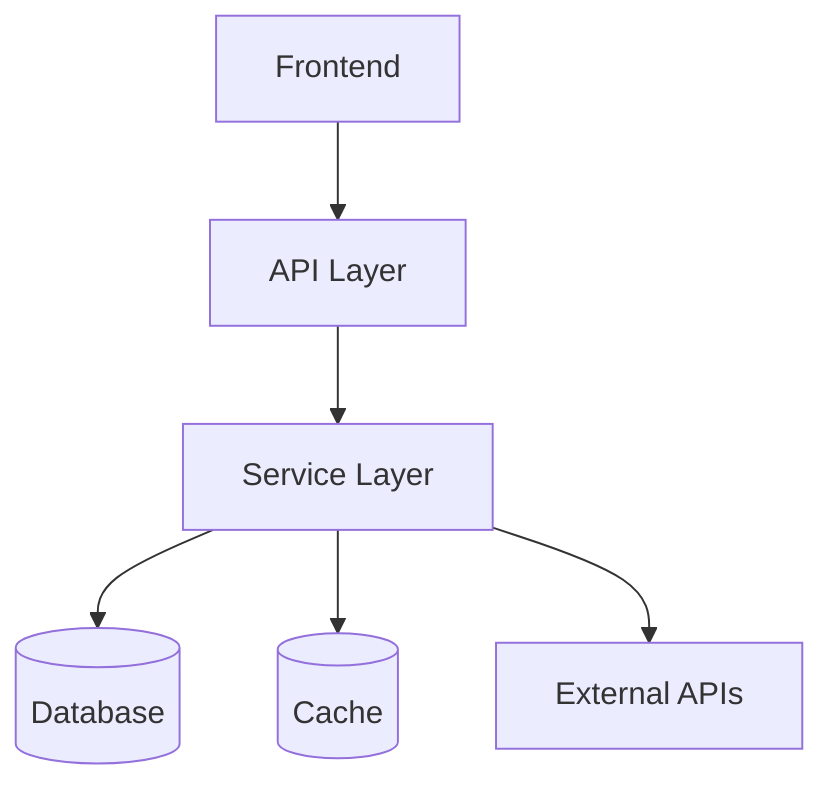

# Stage 07: Architecture Specification

Define HOW the system will be built. Every architectural decision must be justified by technical evidence and aligned with the PRD. This is where TECH_STACK.md choices become concrete implementation patterns.

**This stage ends with an APPROVAL GATE.** Present the architecture for user review before proceeding.

---

## Step 1: Research Architecture Patterns

**Browser: 10-15 searches**

Based on TECH_STACK.md and FEASIBILITY_ASSESSMENT.md:

1. **Framework best practices:**
   - Search for "[framework] project structure best practices [current year]"
   - Search for "[framework] architecture patterns"
   - Read official documentation for project structure recommendations
   - Find 2-3 well-structured open-source projects using the same stack

2. **Domain-specific patterns:**
   - Search for "[product domain] backend architecture"
   - Search for "[product domain] system design"
   - Look for system design blog posts or talks

3. **Library documentation:**
   - For each library in FEASIBILITY_ASSESSMENT.md, read the official docs
   - Check version compatibility between chosen libraries
   - Note any breaking changes in recent versions

4. **Performance patterns:**
   - Search for "[tech stack] performance optimization"
   - Search for "[database] indexing strategies for [data pattern]"
   - Look for caching patterns appropriate to the use case

## Step 2: System Architecture

```markdown
# Architecture Specification

## 1. System Overview

### 1.1 Architecture Style
[Monolith / Microservices / Modular monolith / Serverless — with rationale from research]

### 1.2 High-Level Architecture Diagram
[Textual description or Mermaid diagram]


### 1.3 Technology Decisions
| Layer | Technology | Version | Rationale | Source |
|-------|-----------|---------|-----------|--------|
[Pulled from TECH_STACK.md + FEASIBILITY_ASSESSMENT.md + BUILD_VS_BUY.md]
```

## Step 3: Backend Architecture

```markdown
## 2. Backend Architecture

### 2.1 Package/Module Structure
[Directory layout matching the framework's conventions — verified via browser research]
```
src/
├── [module structure based on tech stack]
```

### 2.2 Interface Definitions
[For each service/module: interfaces, method signatures, input/output types]

**[Tech stack]-specific patterns:**
[If Go: interfaces, struct definitions, package boundaries]
[If Python: abstract base classes, Pydantic models]
[If TypeScript: interfaces, type definitions]
[If Rust: traits, struct definitions]

### 2.3 Data Flow
[Request lifecycle: how a request flows from entry to response]
1. [Entry point] → 2. [Middleware/Auth] → 3. [Handler/Controller] → 4. [Service] → 5. [Repository/DAL] → 6. [Database] → response

### 2.4 Error Handling Strategy
**Invoke skill:** `.agents/skills/antigravity/error_taxonomy.md`

| Error Category | HTTP Status | Error Code | User Message | Internal Action |
|---------------|-------------|------------|-------------|----------------|

### 2.5 Authentication & Authorization
**Invoke skill:** `.agents/skills/antigravity/security_threat_model.md`

- Auth flow: [detailed step-by-step]
- Token management: [strategy]
- Permission model: [RBAC/ABAC/ACL with specifics]
- Session management: [approach]
```

## Step 4: Data Architecture

**Invoke skill:** `.agents/skills/antigravity/database_design.md`
**Invoke skill:** `.agents/skills/antigravity/data_model_design.md`

**Browser: 3-5 searches**
- Search for "[database] schema design for [domain]"
- Search for "[ORM from TECH_STACK.md] migration best practices"

```markdown
## 3. Data Architecture

### 3.1 Entity-Relationship Diagram
[Mermaid ER diagram or textual description]

### 3.2 Table/Collection Definitions
[For each entity: fields, types, constraints, indexes]

### 3.3 Migration Strategy
- Tool: [from TECH_STACK.md]
- Versioning: [sequential numbered / timestamped]
- Rollback: [strategy]
- Zero-downtime: [approach if required]

### 3.4 Indexing Strategy
| Table | Index | Columns | Type | Rationale |
|-------|-------|---------|------|-----------|

### 3.5 Caching Strategy
| Data | Cache Layer | TTL | Invalidation Strategy |
|------|------------|-----|----------------------|
```

## Step 5: API Design

**Invoke skill:** `.agents/skills/antigravity/api_contract_design.md`

**Browser: 3-5 searches**
- Search for "[API style from TECH_STACK.md] design best practices [current year]"
- Search for "[API style] error handling conventions"
- Look at well-designed public APIs in the same domain for pattern inspiration

Write `.agents/handoff/API_CONTRACT.md`:
```markdown
# API Contract

## Base URL & Versioning
- Base: `/api/v1`
- Versioning strategy: [URL path / header / query param]

## Authentication
- Method: [from architecture]
- Header: `Authorization: Bearer <token>`

## Common Response Format
```json
{
  "data": {},
  "meta": { "pagination": {} },
  "errors": [{ "code": "", "message": "", "field": "" }]
}
```

## Endpoints

### [Resource 1]

#### POST /[resource]
**Description:** [what it does]
**Request:**
```json
{ "field": "type — constraints" }
```
**Response (201):**
```json
{ "data": { "id": "string", ... } }
```
**Error Responses:**
| Status | Code | When |
|--------|------|------|

[Repeat for all CRUD operations and custom endpoints]

## Rate Limiting
| Endpoint Pattern | Limit | Window |
|-----------------|-------|--------|

## Pagination
- Style: [cursor / offset]
- Default page size: [N]
- Max page size: [N]
```

## Step 6: Frontend Architecture

```markdown
## 4. Frontend Architecture

### 4.1 Component Architecture
[Based on DESIGN_SYSTEM.md component patterns + TECH_STACK.md framework]
- Component hierarchy
- State management approach
- Data fetching strategy
- Routing structure (from INFORMATION_ARCHITECTURE.md)

### 4.2 State Management
**Invoke skill:** `.agents/skills/antigravity/state_management_design.md`

- Global state: [what lives here, tool/pattern]
- Local state: [component-level state approach]
- Server state: [caching strategy, tool]
- Form state: [approach]

### 4.3 Build & Bundle Configuration
[Based on TECH_STACK.md bundler]
- Code splitting strategy
- Lazy loading boundaries
- Asset optimization
```

## Step 7: Infrastructure & Deployment

**Invoke skill:** `.agents/skills/antigravity/deployment_topology.md`

```markdown
## 5. Deployment Architecture

### 5.1 Environments
| Environment | Purpose | URL Pattern | Data |
|-------------|---------|-------------|------|
| Development | Local dev | localhost | Seed data |
| Staging | Pre-prod validation | staging.* | Sanitized prod |
| Production | Live | prod URL | Real |

### 5.2 Infrastructure Topology
[Services, databases, caches, CDN, etc.]

### 5.3 Health Checks
| Service | Endpoint | Check | Interval |
|---------|----------|-------|----------|

### 5.4 Scaling Rules
| Component | Trigger | Action | Limits |
|-----------|---------|--------|--------|
```

## Step 8: Performance Architecture

**Invoke skill:** `.agents/skills/antigravity/performance_budget.md`

```markdown
## 6. Performance

### 6.1 Performance Budgets
[From PRD NFRs, with implementation approach for each]

### 6.2 Optimization Strategies
| Strategy | Where Applied | Expected Impact |
|----------|--------------|-----------------|
```

## Step 9: Cross-Reference Audit

- [ ] Every PRD user story can be implemented with this architecture
- [ ] Every API endpoint maps to at least one user story
- [ ] Every data entity maps to at least one API endpoint
- [ ] All libraries/tools reference specific versions (verified via browser)
- [ ] Security architecture covers all auth-related user stories
- [ ] Performance architecture meets PRD NFR targets

## Step 10: APPROVAL GATE

**PAUSE HERE.** Present to the user:
1. System architecture overview
2. Key technology decisions with rationale
3. API contract summary
4. Data model overview
5. Any deviations from TECH_STACK.md (if any)

Ask the user to review and approve before proceeding.

## Step 11: Update Pipeline State

```markdown
## Stage 07 — Architecture Specification ✅
- ARCHITECTURE.md produced
- API_CONTRACT.md produced
- ⏸️ APPROVAL GATE — awaiting user review
## Next Stage: 08 — Testing Strategy (after approval)
```
